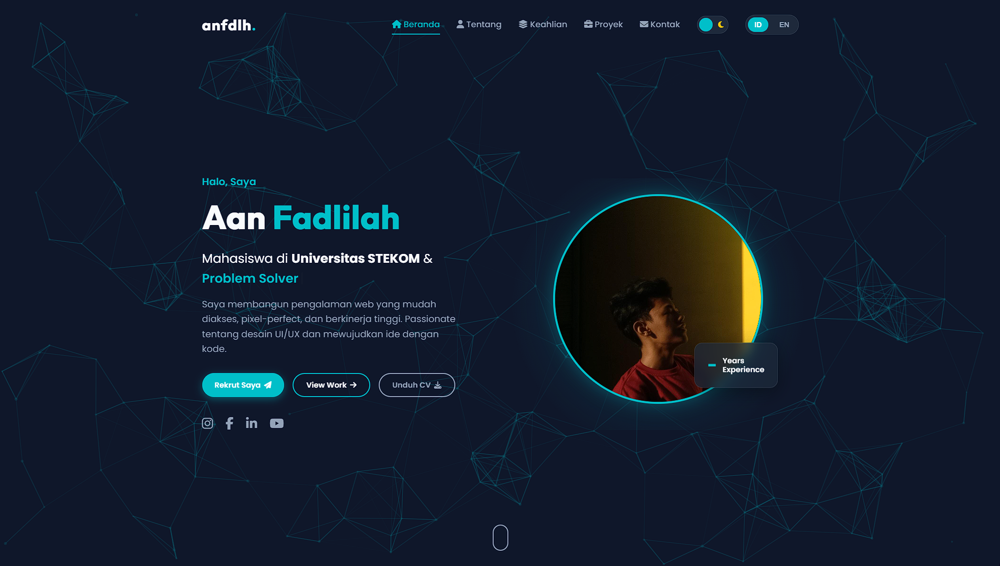

<div align="center">

# 🌟 Aan Fadlilah | Portfolio

[](https://anfdlh.github.io)
[](https://github.com/anfdlh)
[](LICENSE)

**A modern, responsive portfolio website with stunning animations and interactive features**

[View Demo](https://anfdlh.github.io) · [Report Bug](https://github.com/anfdlh/anfdlh.github.io/issues) · [Request Feature](https://github.com/anfdlh/anfdlh.github.io/issues)

</div>

---

## 📸 Preview

<div align="center">
  
</div>


---

## ✨ Features

### 🎨 **Design & UI**

- ✅ **Glassmorphism Design** - Modern glass-morphic UI with blur effects
- ✅ **Dark/Light Theme** - Smooth theme toggle with animated transitions
- ✅ **Custom Cursor** - Interactive custom cursor (desktop only)
- ✅ **Particle Background** - Animated particle network background
- ✅ **Responsive Layout** - Perfect on all devices (mobile, tablet, desktop)

### 🚀 **Animations & Effects**

- ✅ **Scroll Animations** - Beautiful AOS (Animate On Scroll) effects
- ✅ **3D Tilt Cards** - Interactive 3D hover effects on cards
- ✅ **Typing Effect** - Dynamic typing animation for job titles
- ✅ **Smooth Transitions** - Buttery smooth page transitions
- ✅ **Loading Animation** - Elegant intro overlay on page load

### 🌐 **Functionality**

- ✅ **Multi-Language** - Support for Indonesian & English
- ✅ **Project Filtering** - Filter portfolio projects by category
- ✅ **Image Lightbox** - Modal view for project images
- ✅ **Contact Form** - Functional contact form with validation
- ✅ **Toast Notifications** - Custom notification system
- ✅ **Progress Bars** - Animated skill progress indicators

### 📱 **Sections**

- 🏠 **Hero** - Eye-catching landing section with CTA buttons
- 👤 **About** - Personal info with education timeline
- 💼 **Skills** - Interactive skill cards with progress bars
- 🛠️ **Services** - Services offered with hover effects
- 📂 **Projects** - Portfolio gallery with filtering
- 💬 **Testimonials** - Auto-sliding testimonial carousel
- 📧 **Contact** - Contact form and information

---

## 🛠️ Tech Stack

<div align="center">


</div>

### Libraries & Frameworks

- **[AOS](https://michalsnik.github.io/aos/)** - Animate On Scroll Library
- **[Font Awesome 6.5.0](https://fontawesome.com/)** - Icon library
- **[Google Fonts](https://fonts.google.com/)** - Outfit & Poppins fonts

---

## 🚀 Quick Start

### Prerequisites

- A modern web browser (Chrome, Firefox, Safari, Edge)
- Basic text editor (VS Code recommended)

### Installation

1. **Clone the repository**

   ```bash
   git clone https://github.com/anfdlh/anfdlh.github.io.git
   cd anfdlh.github.io
   ```

2. **Open in browser**

   ```bash
   # Simply open index.html in your browser
   # Or use Live Server extension in VS Code
   ```

3. **That's it!** 🎉

---

## 📁 Project Structure

```
portfolio/
│
├── assets/
│   ├── css/
│   │   └── style.css          # Main stylesheet
│   ├── js/
│   │   ├── script.js          # Main JavaScript
│   │   └── quiz.js            # Quiz functionality
│   └── img/
│       ├── profile.png        # Profile images
│       ├── profile2.jpg
│       └── foto1-4.jpg        # Project images
│
├── quiz/
│   ├── quiz-html.html         # HTML quiz
│   └── quiz-css.html          # CSS quiz
│
├── index.html                 # Main HTML file
└── README.md                  # You are here!
```

---

## 🎨 Customization Guide

### 1️⃣ **Personal Information**

Edit `index.html` to update:

- Name and title
- About me description
- Education timeline
- Social media links
- Contact information

### 2️⃣ **Colors & Theme**

Edit CSS variables in `assets/css/style.css`:

```css
:root {
  --primary-color: #00bfc9;
  --bg-color: #0f172a;
  --text-color: #f8fafc;
}
```

### 3️⃣ **Images**

Replace images in `assets/img/`:

- `profile.png` - About section image
- `profile2.jpg` - Hero section image
- `foto1-4.jpg` - Project showcase images

### 4️⃣ **Projects**

Update project cards in `index.html`:

```html
<div class="project-card" data-category="web">
  <div class="project-img">
    
  </div>
  <div class="project-info">
    <span class="category">Category</span>
    <h3>Project Title</h3>
  </div>
</div>
```

### 5️⃣ **Skills**

Modify skill tags and progress bars in `index.html` and update percentages in `assets/js/script.js`

---

## 🌐 Multi-Language Support

The portfolio supports **Indonesian (ID)** and **English (EN)**.

Toggle between languages using the language switcher in the navigation bar.

To add more languages:

1. Add translations in `assets/js/script.js` (translations object)
2. Add language button in navigation
3. Update `setLanguage()` function

---

## 🎯 Features Breakdown

### Custom Cursor

```javascript
// Desktop only - follows mouse movement
// Expands on hover over interactive elements
```

### 3D Tilt Effect

```javascript
// Cards tilt based on mouse position
// Creates depth and interactivity
```

### Particle Background

```javascript
// Canvas-based particle animation
// Particles connect when close together
// Optimized for performance
```

### Theme Toggle

```javascript
// Smooth transition between dark/light modes
// Saves preference to localStorage
// View Transition API for modern browsers
```

---

## 📱 Responsive Design

Breakpoints:

- **Mobile**: < 768px
- **Tablet**: 768px - 992px
- **Desktop**: > 992px

All sections are fully responsive with:

- Flexible grid layouts
- Hamburger menu for mobile
- Touch-friendly interactions
- Optimized images

---

## 🚀 Deployment

### GitHub Pages (Current)

This portfolio is deployed on GitHub Pages:
**https://anfdlh.github.io**

### Deploy Your Own

1. Fork this repository
2. Go to Settings → Pages
3. Select branch: `main`
4. Save and wait for deployment
5. Your site will be live at `https://yourusername.github.io`

### Other Hosting Options

- **Netlify** - Drag and drop deployment
- **Vercel** - Git-based deployment
- **Cloudflare Pages** - Fast global CDN

---

## 🤝 Contributing

Contributions are welcome! Here's how:

1. Fork the project
2. Create your feature branch (`git checkout -b feature/AmazingFeature`)
3. Commit your changes (`git commit -m 'Add some AmazingFeature'`)
4. Push to the branch (`git push origin feature/AmazingFeature`)
5. Open a Pull Request

---

## 📝 To-Do List

- [ ] Add blog section
- [ ] Implement quiz system for all skills
- [ ] Add dark mode toggle animation
- [ ] Create admin panel for easy updates
- [ ] Add more project showcases
- [ ] Implement contact form backend
- [ ] Add Google Analytics
- [ ] SEO optimization

---

## 📄 License

This project is licensed under the MIT License - see the [LICENSE](LICENSE) file for details.

---

## 👤 Author

**Aan Fadlilah**

- 🌐 Website: [anfdlh.github.io](https://anfdlh.github.io)
- 📧 Email: aanfadilahh@gmail.com
- 📱 Instagram: [@aanfdlhh](https://www.instagram.com/aanfdlhh)
- 👨‍💻 GitHub: [@anfdlh](https://github.com/anfdlh)
- 🎥 YouTube: [@anfdlh](https://www.youtube.com/@anfdlh)
- 📘 Facebook: [aan.kapak.9](https://www.facebook.com/aan.kapak.9)

---

## 🙏 Acknowledgments

- [AOS Library](https://michalsnik.github.io/aos/) - Scroll animations
- [Font Awesome](https://fontawesome.com/) - Icons
- [Google Fonts](https://fonts.google.com/) - Typography
- [Unsplash](https://unsplash.com/) - Stock images (if used)
- Inspiration from various portfolio designs on Dribbble & Behance

---

## 💖 Support

If you like this project, please give it a ⭐️!

<div align="center">

### Made with ❤️ by Aan Fadlilah

**© 2024 Aan Fadlilah. All rights reserved.**

</div>
